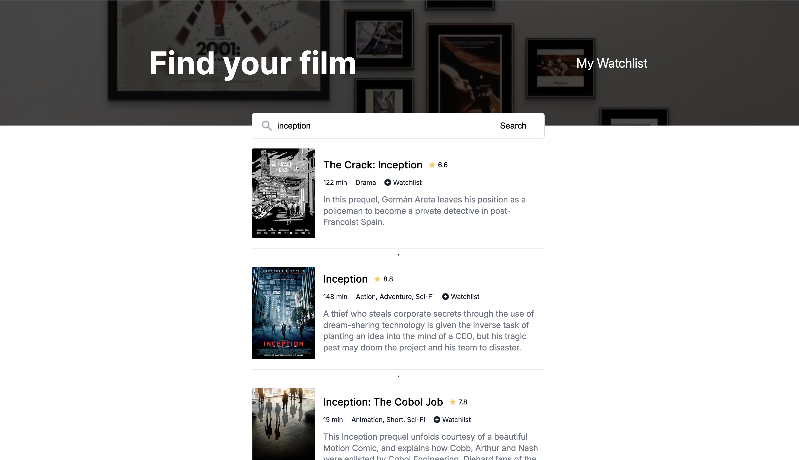
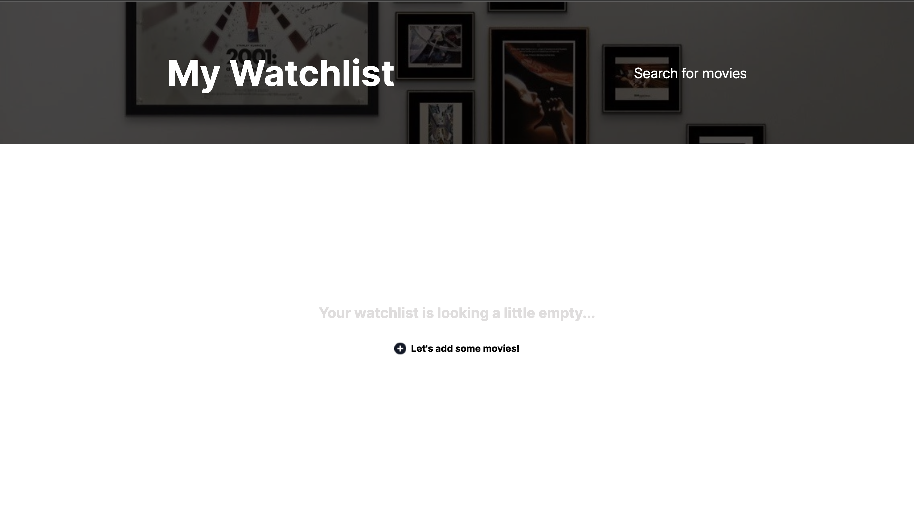
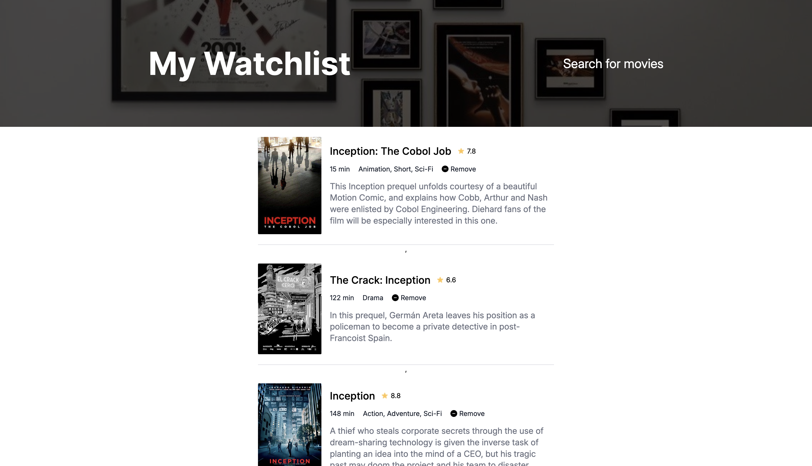

# Movie Watchlist

A movie discovery and watchlist application built with vanilla JavaScript, HTML, and CSS. Search for movies using the OMDb API, view detailed information, and save movies to a personal watchlist using Local Storage.

## Features

- Search for movies by title using the OMDb API
- View movie details including:
  - Poster
  - IMDb rating
  - Runtime
  - Genre
  - Plot summary
- Add movies to a watchlist
- Remove movies from a watchlist
- Persistent watchlist storage with Local Storage
- Handles missing movie data gracefully
- Displays a fallback image when posters are unavailable
- Empty-state and error-state screens

## Screenshots

### Homepage (Empty State)


### Homepage (Search Results)



### Watchlist (Empty State)



### Watchlist (Saved Movies)



## Technologies Used

- HTML5
- CSS3
- JavaScript (ES6+)
- OMDb API
- Local Storage

## Getting Started

### Clone the Repository

```bash
git clone https://github.com/shwarzbergzelda/Movie-Watchlist.git
```

### Navigate to the Project Directory

```bash
cd Movie-Watchlist
```

### Run the Project

Open `index.html` in your browser or use a local development server:

```bash
npx serve
```

## How It Works

### Searching for Movies

When a user searches for a movie title, the application:

1. Queries the OMDb API for matching titles
2. Retrieves detailed information for each result
3. Displays movie cards containing movie information

### Managing the Watchlist

Users can add movies directly from the search results page.

The watchlist:

- Persists across browser sessions
- Is stored in Local Storage
- Can be viewed on a dedicated Watchlist page
- Supports removing movies at any time

## Handling Missing Data

The application handles incomplete API responses by:

- Replacing missing posters with a fallback image
- Hiding unavailable runtime and genre information
- Displaying a fallback message when no plot summary is available
- Showing a user-friendly message when no search results are found

## Future Improvements

- Search by year
- Filter by media type
- Loading indicators during API requests
- Responsive design enhancements
- Sorting and filtering watchlist entries

## Live Demo

https://shwarzbergzelda.github.io/Movie-Watchlist/

## Author

**Zelda Shwarzberg**

GitHub: https://github.com/shwarzbergzelda
